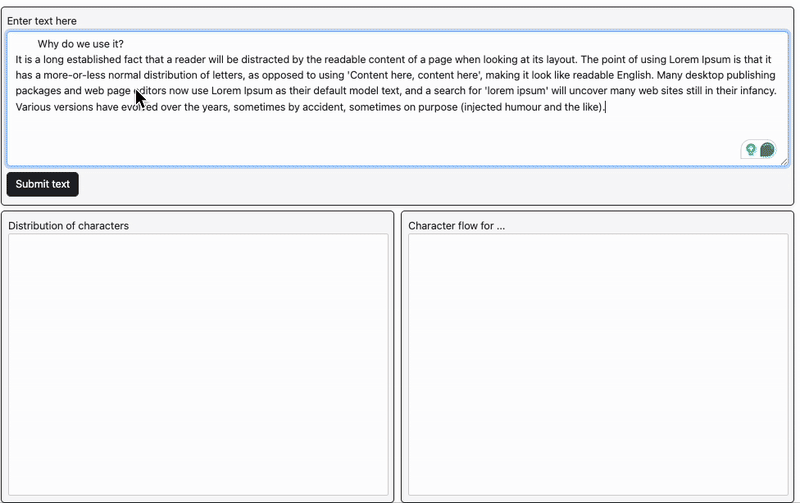

# Data Visualization

The project demonstrates interactive data visualization techniques using JavaScript and D3.js, here I have implemented a Sankey chart from scratch using D3.js.

## Structure

- `index.html` — Main HTML file to view the visualization in a browser.
- `mysankey.js` — JavaScript file for the Sankey diagram or other visualizations.
- `imgs/` — Folder containing images used in the visualization.
- `README.md` — Additional documentation

## Features

- Custom-built Sankey diagram using D3.js
- Interactive and dynamic data flow visualization
- Visual representation of relationships and quantities between nodes

## Interactions

- **Hover over nodes or links:**
  - Displays a tooltip with detailed information about the node or flow (such as name, value, or category).
  - Highlights the hovered node or link for better visibility.
- **Click on nodes:**
  - Highlights all connected flows to and from the selected node, making it easy to trace relationships.
- **Drag nodes:**
  - Allows repositioning of nodes within the Sankey diagram, with links updating dynamically to reflect the new layout.
- **Click outside:**
  - Removes any active highlights or selections, returning the diagram to its default state.

These interactions make it easy to explore the structure and flow of data within the Sankey diagram, providing both overview and detail-on-demand.

## How to Run

1. **Navigate to the main project folder:**

2. **Open `index.html` in your web browser.**
   - You can double-click the file, or use a local web server for best results:
   ```sh
   python3 -m http.server
   # Then visit http://localhost:8000 in your browser
   ```

## Requirements

- Modern web browser (Chrome, Firefox, Edge, etc.)
- [D3.js](https://d3js.org/) (loaded via CDN in `index.html`)

## Author

- Shivam Sharma

---
